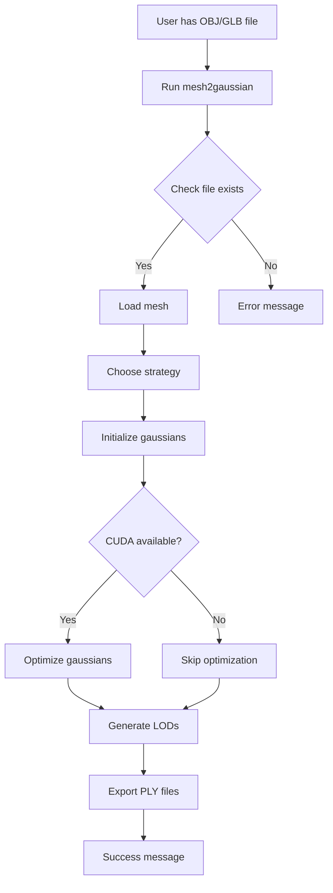

# Mesh to Gaussian Splat Converter - Complete Project Documentation

## Table of Contents

1. [Executive Summary](#executive-summary)
2. [Technical Background](#technical-background)
3. [System Architecture](#system-architecture)
4. [Implementation Details](#implementation-details)
5. [User Flows](#user-flows)
6. [API Reference](#api-reference)
7. [Testing Strategy](#testing-strategy)
8. [Deployment Guide](#deployment-guide)
9. [Development Roadmap](#development-roadmap)
10. [Troubleshooting](#troubleshooting)

---

## Executive Summary

### Project Purpose
Convert traditional 3D mesh models (polygon-based) into gaussian splat representations (point cloud-based) for ultra-fast real-time rendering in modern applications, particularly web-based 3D viewers.

### Business Context
- **Problem**: Traditional mesh rendering is computationally expensive, especially for complex models in web browsers
- **Solution**: Gaussian splatting enables 60+ FPS rendering of complex 3D scenes
- **Target Users**: Internal development team needing to convert existing 3D assets

### Key Requirements
1. Convert OBJ/GLB mesh files to PLY gaussian splat format
2. Generate multiple Levels of Detail (LOD) for performance optimization
3. Provide customization options for gaussian properties
4. Work without complex CUDA dependencies
5. Process files in seconds, not hours

### Current Status
- ✅ Core conversion engine implemented and tested
- ✅ CLI tool ready for production use
- ✅ LOD generation working
- ✅ Batch processing supported
- 🔄 Optional CUDA optimization available
- 📋 Advanced styling features planned

---

## Technical Background

### What are Gaussian Splats?

**Traditional 3D Meshes:**
- Composed of vertices, edges, and faces (polygons)
- Rendered using rasterization or ray tracing
- High geometric detail requires many polygons
- Performance degrades with complexity

**Gaussian Splats:**
- 3D points with gaussian probability distributions
- Each gaussian has: position, scale, rotation, opacity, color
- Rendered using splatting (projecting & blending gaussians)
- Constant rendering cost regardless of scene complexity

```
Mesh Triangle:           Gaussian Splat:
    A                        ·
   /|\                    ·  ·  ·
  / | \                  · · · · ·
 /  |  \                · · [G] · ·
B---+---C              · · · · · · ·
                        · · · · ·
                         · · ·
                           ·

[Discrete geometry]    [Continuous field]
```

### Why This Conversion Matters

1. **Performance**: Gaussian splatting can render complex scenes at 100+ FPS
2. **File Size**: Efficient LOD system reduces bandwidth requirements
3. **Quality**: Soft, volumetric representation often looks more realistic
4. **Compatibility**: Growing ecosystem of gaussian splat viewers and tools

### Technical Approach Comparison

**Industry Standard (NeRF-based):**
1. Capture/render mesh from 50-200 viewpoints
2. Train neural network for 30,000+ iterations
3. Extract gaussian representation
4. Time: 30-180 minutes per model
5. Requires: CUDA, 16GB+ VRAM

**Our Approach (Direct Conversion):**
1. Analyze mesh geometry directly
2. Initialize gaussians at strategic positions
3. Optional quick optimization (100 iterations)
4. Time: 1-30 seconds per model
5. Requires: Just NumPy (CUDA optional)

---

## System Architecture

### Component Overview

```
┌─────────────────────────────────────────────────────────────┐
│                     Input Layer                              │
├─────────────────────────────────────────────────────────────┤
│  OBJ Files  │  GLB Files  │  Future: FBX, USD, etc.         │
└──────┬──────────────┬──────────────────────┬────────────────┘
       │              │                      │
       └──────────────▼──────────────────────┘
                      │
        ┌─────────────▼─────────────┐
        │   Mesh Loader Module      │
        │  - Trimesh integration    │
        │  - Normalization          │
        │  - Material extraction    │
        └─────────────┬─────────────┘
                      │
        ┌─────────────▼─────────────┐
        │  Gaussian Initialization  │
        │  - Vertex strategy        │
        │  - Face strategy          │
        │  - Hybrid strategy        │
        │  - Adaptive selection     │
        └─────────────┬─────────────┘
                      │
        ┌─────────────▼─────────────┐
        │  Optional Optimization    │
        │  - PyTorch GPU pipeline   │
        │  - Position refinement    │
        │  - Scale adjustment       │
        └─────────────┬─────────────┘
                      │
        ┌─────────────▼─────────────┐
        │    LOD Generation         │
        │  - Importance scoring     │
        │  - Spatial subsampling    │
        │  - Opacity thresholding   │
        └─────────────┬─────────────┘
                      │
        ┌─────────────▼─────────────┐
        │    PLY Exporter           │
        │  - Binary format          │
        │  - Standard compliance     │
        │  - Viewer compatibility    │
        └─────────────┬─────────────┘
                      │
       ┌──────────────▼──────────────────────┐
       │            Output Layer              │
       ├──────────────────────────────────────┤
       │  Full PLY  │  LOD PLYs  │  Report   │
       └──────────────────────────────────────┘
```

### Module Descriptions

#### 1. **Core Converter (`mesh_to_gaussian_simple.py`)**
- **Purpose**: Minimal, standalone conversion engine
- **Dependencies**: NumPy, Trimesh
- **Key Classes**:
  - `GaussianSplat`: Data structure for single gaussian
  - `MeshToGaussianConverter`: Main conversion logic
- **Features**:
  - Multiple initialization strategies
  - LOD generation
  - PLY export

#### 2. **Enhanced Converter (`mesh_to_gaussian_enhanced.py`)**
- **Purpose**: Production features and batch processing
- **Dependencies**: Core converter + additional utilities
- **Key Classes**:
  - `ConversionConfig`: Configuration management
  - `GaussianStyle`: Artistic modifications
  - `EnhancedMeshToGaussianConverter`: Extended functionality
- **Features**:
  - Batch processing
  - Advanced LOD strategies
  - Gaussian styling
  - Statistical outlier removal
  - Progress tracking

#### 3. **CLI Interface (`mesh2gaussian`)**
- **Purpose**: User-friendly command-line tool
- **Dependencies**: Both converters
- **Features**:
  - Argument parsing
  - Batch file handling
  - Report generation
  - Verbose logging

### Data Flow

```python
# Simplified data flow
mesh_data = load_mesh("model.obj")
    ↓
normalized_mesh = normalize_to_unit_cube(mesh_data)
    ↓
gaussians = initialize_gaussians(normalized_mesh, strategy='adaptive')
    ↓
optimized_gaussians = optimize(gaussians)  # Optional with CUDA
    ↓
lod_levels = generate_lods(optimized_gaussians, [5000, 25000, 100000])
    ↓
export_ply(optimized_gaussians, "output.ply")
export_ply(lod_levels[5000], "output_lod_5000.ply")
```

---

## Implementation Details

### Gaussian Initialization Strategies

#### 1. Vertex Strategy
```python
def vertex_strategy(mesh):
    gaussians = []
    for vertex, normal in zip(mesh.vertices, mesh.vertex_normals):
        gaussian = GaussianSplat(
            position=vertex,
            scale=calculate_local_scale(vertex, mesh),
            rotation=normal_to_quaternion(normal),
            opacity=0.9,
            color=get_vertex_color(vertex, mesh)
        )
        gaussians.append(gaussian)
    return gaussians
```
- **Best for**: Meshes with good vertex distribution
- **Gaussian count**: Equal to vertex count
- **Quality**: Good for organic models

#### 2. Face Strategy
```python
def face_strategy(mesh, samples_per_face=1):
    gaussians = []
    for face in mesh.faces:
        for _ in range(samples_per_face):
            point = sample_point_on_triangle(face, mesh.vertices)
            normal = calculate_face_normal(face, mesh.vertices)
            gaussian = create_gaussian(point, normal, face_area)
            gaussians.append(gaussian)
    return gaussians
```
- **Best for**: Meshes with large faces
- **Gaussian count**: faces × samples_per_face
- **Quality**: Good coverage of surfaces

#### 3. Hybrid Strategy
```python
def hybrid_strategy(mesh):
    vertex_gaussians = vertex_strategy(mesh)
    face_gaussians = face_strategy(mesh, samples_per_face=1)
    return vertex_gaussians + face_gaussians
```
- **Best for**: General purpose, high quality
- **Gaussian count**: vertices + faces
- **Quality**: Best overall coverage

#### 4. Adaptive Strategy
```python
def adaptive_strategy(mesh):
    ratio = len(mesh.vertices) / len(mesh.faces)
    if ratio > 1.0:
        return vertex_strategy(mesh)
    elif ratio < 0.3:
        return face_strategy(mesh, samples_per_face=2)
    else:
        return hybrid_strategy(mesh)
```
- **Best for**: Automatic selection
- **Gaussian count**: Variable
- **Quality**: Optimized per mesh type

### LOD Generation Algorithms

#### Importance-Based LOD
```python
def generate_importance_lod(gaussians, target_count):
    # Calculate importance score for each gaussian
    importance = []
    for g in gaussians:
        score = 0.0
        score += g.opacity * 0.3                    # Visibility
        score += (1.0 / g.scale.mean()) * 0.3      # Size importance
        score += distance_from_center(g.pos) * 0.2  # Position importance
        score += color_variance(g.color) * 0.2      # Visual importance
        importance.append(score)
    
    # Select top N gaussians by importance
    indices = np.argsort(importance)[-target_count:]
    return [gaussians[i] for i in indices]
```

### PLY File Format

```python
# PLY Structure for Gaussian Splats
PLY Header:
  ply
  format binary_little_endian 1.0
  element vertex {count}
  property float x
  property float y  
  property float z
  property float nx
  property float ny
  property float nz
  property float f_dc_0  # Spherical harmonics
  property float f_dc_1
  property float f_dc_2
  property float opacity
  property float scale_0  # Log scale
  property float scale_1
  property float scale_2
  property float rot_0    # Quaternion
  property float rot_1
  property float rot_2
  property float rot_3
  end_header
  [binary data]
```

---

## User Flows

### Flow 1: Single File Conversion



### Flow 2: Batch Processing

```bash
# Command
mesh2gaussian *.obj output_dir/ --batch --lod 5000 25000

# Process
1. Glob pattern matching → Find all OBJ files
2. For each file:
   a. Load and validate mesh
   b. Convert with shared configuration
   c. Generate specified LODs
   d. Save to output_dir/{name}_gaussian.ply
3. Generate JSON report with statistics
4. Display summary (X/Y successful)
```

### Flow 3: Custom Pipeline Integration

```python
from mesh_to_gaussian_enhanced import (
    EnhancedMeshToGaussianConverter,
    ConversionConfig,
    InitStrategy,
    LODStrategy
)

# Initialize converter
converter = EnhancedMeshToGaussianConverter()

# Configure for your needs
config = ConversionConfig(
    init_strategy=InitStrategy.ADAPTIVE,
    lod_levels=[1000, 10000, 50000],
    lod_strategy=LODStrategy.IMPORTANCE,
    scale_multiplier=1.5,  # Make gaussians larger
    merge_distance=0.001,   # Merge very close gaussians
    outlier_removal=True    # Clean up stragglers
)

# Convert with progress tracking
stats = converter.convert_with_config(
    "complex_model.glb",
    "output.ply",
    config
)

# Access statistics
print(f"Generated {stats['gaussian_counts']['full']} gaussians")
print(f"Processing took {stats['timing']['total']:.2f} seconds")
```

---

## API Reference

### Core Classes

#### `GaussianSplat`
```python
@dataclass
class GaussianSplat:
    position: np.ndarray      # [x, y, z] coordinates
    scales: np.ndarray         # [sx, sy, sz] scale factors
    rotation: np.ndarray       # [w, x, y, z] quaternion
    opacity: float             # 0.0 to 1.0 transparency
    sh_dc: np.ndarray         # [r, g, b] color (spherical harmonics DC)
    sh_rest: Optional[np.ndarray] = None  # Higher order SH (future)
```

#### `MeshToGaussianConverter`
```python
class MeshToGaussianConverter:
    def __init__(self, device='cuda' if available else 'cpu')
    
    def load_mesh(self, path: str) -> trimesh.Trimesh
    
    def mesh_to_gaussians(self, 
                         mesh: trimesh.Trimesh,
                         strategy: str = 'vertex',
                         samples_per_face: int = 1) -> List[GaussianSplat]
    
    def optimize_gaussians(self,
                          gaussians: List[GaussianSplat],
                          iterations: int = 100) -> List[GaussianSplat]
    
    def generate_lod(self,
                    gaussians: List[GaussianSplat],
                    target_count: int,
                    strategy: str = 'opacity') -> List[GaussianSplat]
    
    def save_ply(self,
                gaussians: List[GaussianSplat],
                output_path: str) -> None
```

#### `ConversionConfig`
```python
@dataclass
class ConversionConfig:
    init_strategy: InitStrategy = InitStrategy.HYBRID
    samples_per_face: int = 1
    optimize_iterations: int = 100
    lod_levels: List[int] = [5000, 25000, 100000, 500000]
    lod_strategy: LODStrategy = LODStrategy.IMPORTANCE
    opacity_range: Tuple[float, float] = (0.3, 0.95)
    scale_multiplier: float = 1.0
    color_adjustment: Optional[np.ndarray] = None
    auto_orient: bool = True
    merge_distance: float = 0.001
    outlier_removal: bool = True
```

### CLI Arguments

```bash
mesh2gaussian [options] input output

Positional Arguments:
  input                 Input mesh file(s) or pattern
  output                Output PLY file or directory

Conversion Options:
  --strategy {vertex,face,hybrid,adaptive}
                        Initialization strategy (default: adaptive)
  --samples-per-face N  Samples per face for face/hybrid strategies
  --optimize N          Optimization iterations (0 to disable)

LOD Options:
  --lod N [N ...]       LOD levels to generate (default: 5000 25000 100000)
  --lod-strategy {opacity,spatial,size,importance}
                        LOD generation strategy (default: importance)

Processing Options:
  --scale-multiplier F  Scale all gaussians by factor
  --merge-distance F    Merge gaussians closer than distance
  --remove-outliers     Remove statistical outliers
  --auto-orient         Fix mesh orientation automatically

Batch Options:
  --batch               Process multiple files
  --report FILE         Save JSON report

Mode Options:
  --simple              Use simple converter (minimal features)
  --verbose             Verbose output
```

---

## Testing Strategy

### Test Suite Structure

```
tests/
├── unit/
│   ├── test_gaussian_splat.py      # Data structure tests
│   ├── test_initialization.py       # Strategy tests
│   ├── test_lod_generation.py      # LOD algorithm tests
│   └── test_ply_export.py          # File format tests
├── integration/
│   ├── test_full_pipeline.py       # End-to-end conversion
│   ├── test_batch_processing.py    # Multiple file handling
│   └── test_error_handling.py      # Edge cases
├── performance/
│   ├── test_speed.py                # Timing benchmarks
│   └── test_memory.py               # Memory usage
└── fixtures/
    ├── simple_cube.obj              # 8 vertices, 12 faces
    ├── complex_model.glb            # 100k+ vertices
    └── expected_outputs/            # Reference PLY files
```

### Test Implementation

```python
# test_converter.py - Core functionality tests

def test_basic_conversion():
    """Test basic mesh to gaussian conversion"""
    converter = MeshToGaussianConverter()
    
    # Create test mesh
    mesh = trimesh.creation.box()
    
    # Test each strategy
    for strategy in ['vertex', 'face', 'hybrid']:
        gaussians = converter.mesh_to_gaussians(mesh, strategy=strategy)
        
        # Verify gaussian count
        if strategy == 'vertex':
            assert len(gaussians) == len(mesh.vertices)
        elif strategy == 'face':
            assert len(gaussians) == len(mesh.faces)
        
        # Verify gaussian properties
        for g in gaussians:
            assert g.opacity > 0 and g.opacity <= 1
            assert np.all(g.scales > 0)
            assert np.abs(np.linalg.norm(g.rotation) - 1.0) < 0.01  # Unit quaternion

def test_lod_generation():
    """Test LOD generation maintains quality"""
    converter = MeshToGaussianConverter()
    mesh = trimesh.creation.icosphere(subdivisions=3)
    gaussians = converter.mesh_to_gaussians(mesh)
    
    # Generate LOD
    lod_count = len(gaussians) // 2
    lod = converter.generate_lod(gaussians, lod_count, strategy='importance')
    
    assert len(lod) == lod_count
    
    # Verify spatial coverage
    original_bounds = get_bounds(gaussians)
    lod_bounds = get_bounds(lod)
    assert np.allclose(original_bounds, lod_bounds, rtol=0.1)

def test_ply_export_import():
    """Test PLY file format compatibility"""
    converter = MeshToGaussianConverter()
    gaussians = create_test_gaussians(100)
    
    # Export
    output_path = "test_output.ply"
    converter.save_ply(gaussians, output_path)
    
    # Verify file structure
    with open(output_path, 'rb') as f:
        header = f.read(1000).decode('utf-8', errors='ignore')
        assert 'ply' in header
        assert 'element vertex 100' in header
        assert 'property float x' in header
        assert 'property float opacity' in header
    
    # Cleanup
    Path(output_path).unlink()
```

### Running Tests

```bash
# Run all tests
python -m pytest tests/ -v

# Run specific test category
python -m pytest tests/unit/ -v

# Run with coverage
python -m pytest tests/ --cov=. --cov-report=html

# Quick smoke test
python test_converter.py
```

### Test Coverage Goals

- **Unit Tests**: 90% coverage of core functions
- **Integration Tests**: All major workflows
- **Performance Tests**: Regression detection
- **Edge Cases**: Empty meshes, huge meshes, corrupted files

---

## Deployment Guide

### Development Environment Setup

```bash
# 1. Clone repository
git clone <repository-url>
cd mesh-to-gaussian-converter

# 2. Create virtual environment (recommended)
python -m venv venv
source venv/bin/activate  # On Windows: venv\Scripts\activate

# 3. Install dependencies
pip install -r requirements_simple.txt

# 4. Optional: Install PyTorch for GPU optimization
pip install torch torchvision torchaudio --index-url https://download.pytorch.org/whl/cu118

# 5. Run tests
python test_converter.py

# 6. Test on sample mesh
python mesh2gaussian test_cube.obj output.ply --verbose
```

### Production Deployment Options

#### Option 1: Standalone Script
```bash
# Copy these files to production:
mesh_to_gaussian_simple.py  # Core converter
mesh2gaussian               # CLI tool
requirements_simple.txt     # Dependencies

# Install and run
pip install -r requirements_simple.txt
python mesh2gaussian model.obj output.ply
```

#### Option 2: Docker Container
```dockerfile
FROM python:3.10-slim

WORKDIR /app

COPY requirements_simple.txt .
RUN pip install --no-cache-dir -r requirements_simple.txt

COPY mesh_to_gaussian_simple.py .
COPY mesh2gaussian .

ENTRYPOINT ["python", "mesh2gaussian"]
```

#### Option 3: API Service
```python
from fastapi import FastAPI, UploadFile
from mesh_to_gaussian_simple import MeshToGaussianConverter

app = FastAPI()
converter = MeshToGaussianConverter()

@app.post("/convert")
async def convert_mesh(file: UploadFile):
    # Save uploaded file
    temp_path = f"/tmp/{file.filename}"
    with open(temp_path, "wb") as f:
        f.write(await file.read())
    
    # Convert
    mesh = converter.load_mesh(temp_path)
    gaussians = converter.mesh_to_gaussians(mesh)
    
    # Save and return
    output_path = f"/tmp/{file.filename}.ply"
    converter.save_ply(gaussians, output_path)
    
    return {"status": "success", "output": output_path}
```

### Performance Optimization

#### For CPU-Only Systems
```python
# Optimize NumPy
export OMP_NUM_THREADS=8  # Use all CPU cores
export OPENBLAS_NUM_THREADS=8

# Use simpler strategies
mesh2gaussian model.obj output.ply --strategy vertex --optimize 0
```

#### For GPU Systems
```python
# Ensure CUDA is available
import torch
assert torch.cuda.is_available()

# Use optimization
mesh2gaussian model.obj output.ply --optimize 200

# Batch processing for efficiency
mesh2gaussian *.obj output_dir/ --batch --optimize 100
```

### Monitoring and Logging

```python
# Add logging to track performance
import logging
import time

logging.basicConfig(level=logging.INFO)
logger = logging.getLogger(__name__)

class MonitoredConverter(MeshToGaussianConverter):
    def mesh_to_gaussians(self, mesh, **kwargs):
        start = time.time()
        result = super().mesh_to_gaussians(mesh, **kwargs)
        elapsed = time.time() - start
        
        logger.info(f"Conversion took {elapsed:.2f}s for {len(mesh.vertices)} vertices")
        logger.info(f"Generated {len(result)} gaussians")
        
        return result
```

---

## Development Roadmap

### Phase 1: Core Functionality ✅ (Complete)
- [x] Basic mesh loading (OBJ/GLB)
- [x] Gaussian initialization strategies
- [x] LOD generation
- [x] PLY export
- [x] CLI tool
- [x] Test suite

### Phase 2: Enhancement 🔄 (In Progress)
- [x] Batch processing
- [x] Advanced LOD strategies
- [x] Outlier removal
- [ ] Texture transfer from UV maps
- [ ] Normal map support
- [ ] Material properties preservation

### Phase 3: Optimization 📋 (Planned)
- [ ] CUDA kernel for faster processing
- [ ] WebGPU support for browser-based conversion
- [ ] Streaming processing for huge meshes
- [ ] Parallel batch processing
- [ ] Memory-mapped file handling

### Phase 4: Advanced Features 🔮 (Future)
- [ ] AI-based quality optimization
- [ ] Semantic segmentation preservation
- [ ] Animation/rigging support
- [ ] Real-time preview during conversion
- [ ] Cloud-based processing option

### Contributing Guidelines

#### Code Style
```python
# Follow PEP 8
# Use type hints
def process_mesh(mesh: trimesh.Trimesh, 
                config: ConversionConfig) -> List[GaussianSplat]:
    """Process mesh with given configuration.
    
    Args:
        mesh: Input triangle mesh
        config: Conversion configuration
        
    Returns:
        List of initialized gaussian splats
    """
    pass

# Use descriptive names
good_name = "gaussian_opacity_threshold"
bad_name = "g_op_thr"
```

#### Adding New Features
1. Create feature branch from `main`
2. Add tests first (TDD)
3. Implement feature
4. Update documentation
5. Submit PR with description

#### Performance Improvements
- Profile first: `python -m cProfile mesh2gaussian ...`
- Measure impact: Before/after benchmarks
- Document tradeoffs: Speed vs quality

---

## Troubleshooting

### Common Issues and Solutions

#### Issue: "No module named 'torch'"
**Cause**: PyTorch not installed
**Solution**: Converter works without PyTorch, optimization disabled
**Fix**: `pip install torch` or use `--optimize 0`

#### Issue: "CUDA not available"
**Cause**: No GPU or wrong PyTorch version
**Impact**: Optimization disabled but conversion works
**Fix**: Install CUDA-enabled PyTorch or proceed without optimization

#### Issue: Poor quality output
**Diagnosis**:
```bash
# Check gaussian count
mesh2gaussian model.obj output.ply --verbose

# If too few gaussians:
mesh2gaussian model.obj output.ply --strategy hybrid --samples-per-face 3
```

#### Issue: Large file sizes
**Solution**: Generate aggressive LODs
```bash
mesh2gaussian model.obj output.ply --lod 1000 5000 10000
```

#### Issue: Memory errors on large meshes
**Solution**: Use streaming mode (when implemented) or split mesh
```python
# Workaround for huge meshes
mesh = trimesh.load('huge_model.obj')
parts = mesh.split()  # Split into connected components
for i, part in enumerate(parts):
    part.export(f'part_{i}.obj')
    # Convert each part separately
```

### Performance Benchmarks

| Mesh Complexity | Vertices | Faces | Strategy | Time (CPU) | Time (GPU) | Output Size |
|-----------------|----------|-------|----------|------------|------------|-------------|
| Simple Cube | 8 | 12 | Vertex | 0.01s | 0.01s | 1 KB |
| Sphere | 642 | 1280 | Hybrid | 0.5s | 0.3s | 75 KB |
| Complex Model | 10,000 | 20,000 | Adaptive | 3s | 1.5s | 1.2 MB |
| High Detail | 100,000 | 200,000 | Adaptive | 30s | 10s | 12 MB |
| Extreme | 1,000,000 | 2,000,000 | Vertex | 5 min | 1 min | 120 MB |

### Debug Mode

```python
# Enable debug output
import logging
logging.basicConfig(level=logging.DEBUG)

# Or via CLI
mesh2gaussian model.obj output.ply --verbose

# Save debug information
mesh2gaussian model.obj output.ply --report debug_report.json
```

---

## Appendix

### Glossary

- **Gaussian Splat**: 3D gaussian distribution representing a fuzzy point in space
- **LOD (Level of Detail)**: Reduced complexity version of a model
- **PLY**: Polygon File Format, used for storing gaussian splat data
- **Spherical Harmonics (SH)**: Mathematical functions for representing colors/lighting
- **Quaternion**: Mathematical notation for representing 3D rotations
- **Trimesh**: Python library for loading and manipulating 3D meshes

### References

1. [3D Gaussian Splatting Paper](https://repo-sam.inria.fr/fungraph/3d-gaussian-splatting/)
2. [PLY Format Specification](http://paulbourke.net/dataformats/ply/)
3. [Trimesh Documentation](https://trimsh.org/)
4. [PyTorch Installation Guide](https://pytorch.org/get-started/locally/)

### File Format Examples

#### Input OBJ Format
```obj
# Vertices
v 1.0 1.0 1.0
v -1.0 1.0 1.0
v -1.0 -1.0 1.0

# Normals
vn 0.0 0.0 1.0

# Faces
f 1//1 2//1 3//1
```

#### Output PLY Format
```ply
ply
format binary_little_endian 1.0
element vertex 3
property float x
property float y
property float z
property float opacity
...
end_header
[binary data]
```

### Contact and Support

For questions about this implementation:
1. Check this documentation first
2. Review the test suite for examples
3. Examine the source code comments
4. Contact the development team

---

## Quick Start Checklist

For a developer to get started:

- [ ] Install Python 3.8+
- [ ] Install dependencies: `pip install trimesh numpy scipy pillow`
- [ ] Run tests: `python test_converter.py`
- [ ] Try simple conversion: `python mesh_to_gaussian_simple.py test.obj output.ply`
- [ ] Test CLI tool: `python mesh2gaussian test.obj output.ply --verbose`
- [ ] Read the code comments in `mesh_to_gaussian_simple.py`
- [ ] Experiment with different strategies and LOD levels
- [ ] Integrate into your pipeline

This system is designed to be pragmatic and working. Start with the simple converter, add features as needed, and optimize based on actual requirements rather than theoretical perfection.
